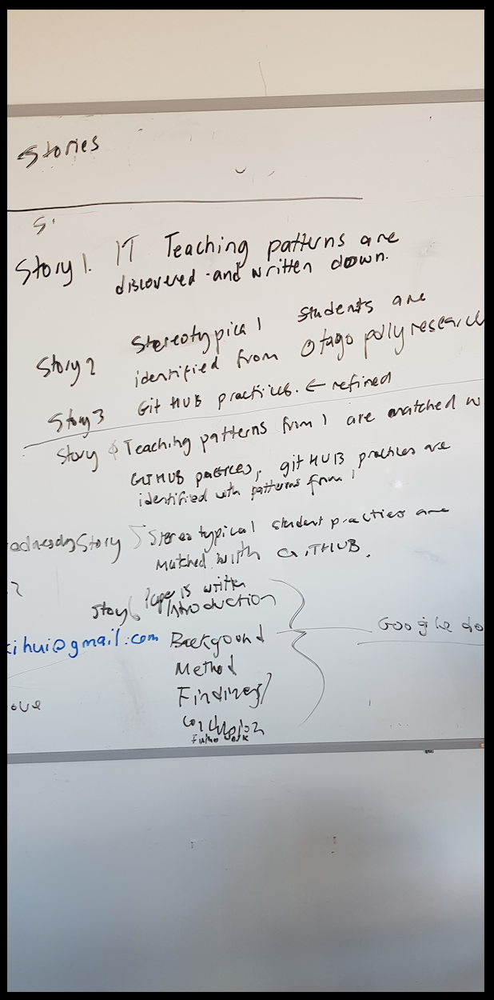
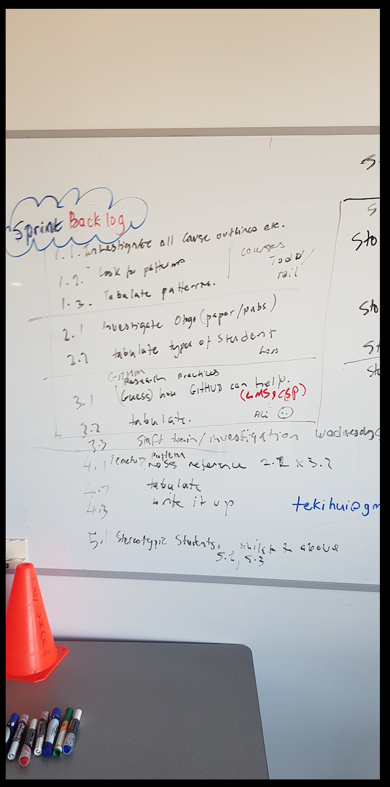
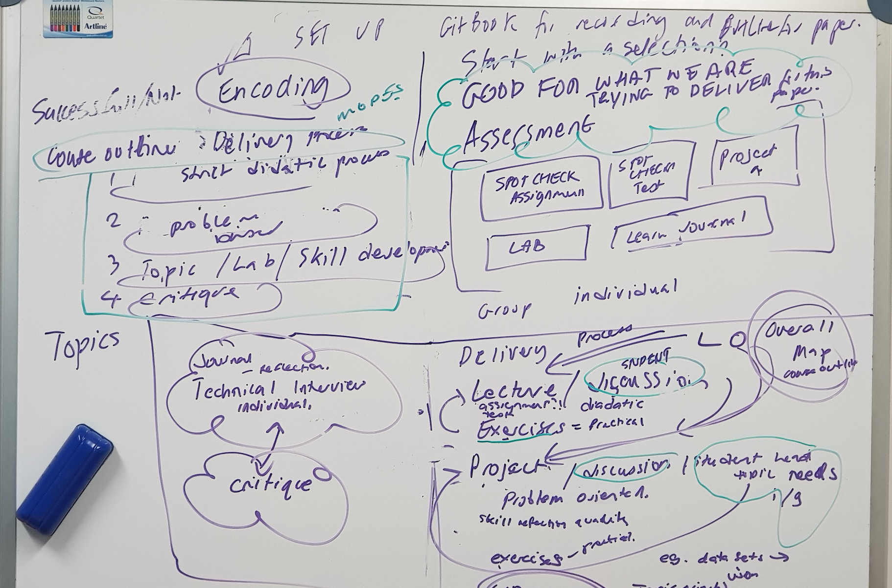
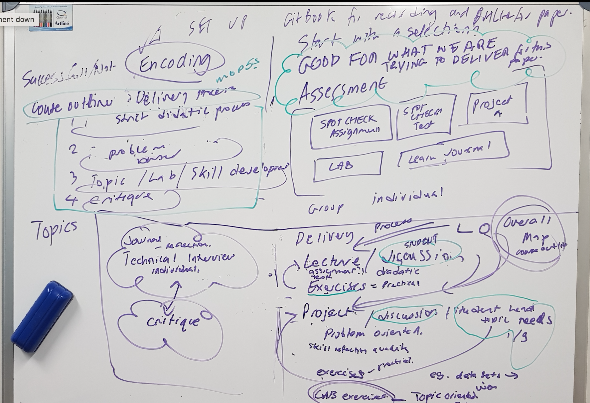

# BIT CGI Research Week

## Monday 26-08-2019

### 9:30am - 11am

* Research week Brainstorm 

### 11:15am-12:30pm

* Design board 
* Stories constructed in to stories and phases 

### 1:30pm-2:30pm

* Created a sprint backlog for Research week.

### Team members assignments 

* [x] Investigating all courses. \(Dr.Todd and Neil\)
  * [ ] Look for patterns.
  * [ ] Tabulate patterns    
* [x] Investigating Otago methods \(Lars\)
  * [ ] Tabulate types of students.
* [x] GitHub research practices \(Ali\)
  * [ ] Research how Github can help?
  * [ ] Tabulate
  * [ ] Team training.

## Tuesday 27-08-2019 

### 9:30am - 1pm

Review GitBook, using it for our work space. \( Research Team\)

#### BIT and CGI courses : \(Dr.Todd and Neil\)

1. CGI501 Prof Pract
2. CGI502 3D Modelling 1
3. CGI503 Rigging Animation 1
4. CGI504 Dynamic Effects 1
5. CGI505 Lighting and Post-production
6. CGI506 Technical Development
7. CGI507 CGI Project 1
8. COM502
9. CSA502\*
10. DAT502
11. DES501
12. NET502 \*
13. OSA501\*
14. SDV503
15. SDV502
16. SYD502
17. TEC501\*
18. WEB502 F
19. WEB503
20. SCM501
21. DAT601 Project MS 1,2,3
22. DAT602 Project MS 1,2,3
23. NET603 Pract Network development
24. NET602 Network Management
25. PFW601 Prof Writting
26. SDV601 Mattias pattern
27. SDV602 Project MS 1,2,3
28. SEC602 
29. SYD601
30. WEB601 MS 1,2,3 
31. MUV601 
32. DAT701 
33. NET701 
34. NET702
35. PRJ701 - project
36. PRJ702 
37. RES701
38. SDV701 tiered SD
39. SYD701
40. WEB701
41. INF755 Proj Man
42. SEC701 Systems Sec

#### Setting up Gitbook for Research week \(Ali\) 

Getting Research team members on the Gitbook repo and getting the workflow documented and shared among others.

#### GitHub research practices \(Ali\)

Created a new page for writing thesis as an example  with git and github.

#### Types of student \(Lars\)

Created a page for personas based on previous case study by Otago University.

Use of Github in Education 

### 2pm-4pm

Team counting on with the giving tasks

### 4pm-5:30pm 

### Team discussion/brainstorming 

