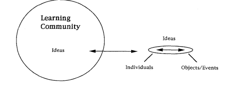

# Constructivism and constructionism

The reason for extending a bit here, is that I see constructivism and constructionism \(Dewey, 2004; Papert, 1980\) as the dynamics and the description of the dynamics of the room in the middle of the triangle we defined, between 'assessment/delivery', 'the students' and 'the tools that are being used'. If we are actually constructing something in the process with our tools, then we are more in the constructionism area \(Papert, 1980, Schwartz, 1999\). And I think that this is where we are with our focus on tools that produce artefacts.

One other perspective that could bridge between our theoretical perspectives, is the way John Dewey defines constructivism \(Prawat, 1996\) ; I find his Idea-Based Social Constructivism to be an example of what we are aiming to achieve in our teaching/learning.

Dewey, J. \(2004\). Democracy and education \(Dover ed\). Mineola, N.Y.: Dover Publications.

Papert, S. \(1980\). Mindstorms: Children, computers, and powerful ideas. Basic Books, Inc.

Prawat, R. S. \(1996\). Constructivisms, modern and postmodern. Educational Psychologist, 31\(3–4\), 215–225.

Schwartz, D. \(1999\). Ghost in the Machine: Seymour Papert on How Computers Fundamentally Change the Way Kids Learn.

